<!-- ============================================================ -->
<!-- 1. ANIMATED INTRO -->
<!-- ============================================================ -->

<!--  -->

 

<!-- ============================================================ -->
<!-- 2. ABOUT MYSELF -->
<!-- ============================================================ -->
## 📖 About Myself

I'm an Artificial Intelligence and Machine Learning student building real, working AI systems — not just tutorials. My focus is on the intersection of **speech, language, and vision**: taking research-grade ideas like voice cloning, transformer-based NLP, and OCR-driven verification, and turning them into applications people can actually use.

I like projects that force me to touch the whole stack — from the model, to the pipeline that feeds it, to the interface someone clicks through. That's why each of my projects below goes end-to-end rather than stopping at a notebook.

<!-- ============================================================ -->
<!-- 3. WHO AM I -->
<!-- ============================================================ -->
## 🙋 Who Am I

| | |
|---|---|
| 🎓 **Studying** | B.Tech, Artificial Intelligence & Machine Learning |
| 🏫 **At** | Sri Shakthi Institute of Engineering and Technology, Coimbatore |
| 📍 **Based in** | Coimbatore, India |
| 🧭 **Focused on** | Generative AI · NLP · Computer Vision · Speech Processing · RAG |
| 🛠️ **Currently building** | AI-powered applications with Python, Flask & MongoDB |
| ⚡ **Fun fact** | I'd rather ship a rough working prototype than a polished slide deck |

---

<!-- ============================================================ -->
<!-- 4. SKILLS (ANIMATED, WITH LOGOS) -->
<!-- ============================================================ -->
## ⚔️ Skills

<!-- 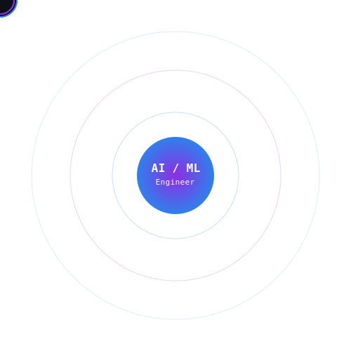

  -->

 <!-- <h2>⚡ Tech Stack</h2> -->

<!-- 

 -->
<filter id="glass-shadow" x="-20%" y="-20%" width="140%" height="140%">
  <feGaussianBlur in="SourceAlpha" stdDeviation="4" result="blur1" />
  <feOffset dx="0" dy="4" result="offsetBlur" />
  <feComponentTransfer in="offsetBlur" result="shadow">
    <feFuncA type="linear" slope="0.3" />
  </feComponentTransfer>
  <feMerge>
    <feMergeNode in="shadow" />
    <feMergeNode in="SourceGraphic" />
  </feMerge>
</filter>

<linearGradient id="line-pulse" x1="0%" y1="0%" x2="100%" y2="100%">
  <stop offset="0%" stop-color="#60A5FA" stop-opacity="0.8" />
  <stop offset="50%" stop-color="#C084FC" stop-opacity="1" />
  <stop offset="100%" stop-color="#22D3EE" stop-opacity="0.8" />
</linearGradient>

<linearGradient id="grad-prog" x1="0%" y1="0%" x2="100%" y2="100%">
  <stop offset="0%" stop-color="#3B82F6" stop-opacity="0.3" />
  <stop offset="100%" stop-color="#60A5FA" stop-opacity="0.1" />
</linearGradient>
<linearGradient id="stroke-prog" x1="0%" y1="0%" x2="100%" y2="100%">
  <stop offset="0%" stop-color="#60A5FA" stop-opacity="0.7" />
  <stop offset="100%" stop-color="#93C5FD" stop-opacity="0.2" />
</linearGradient>

<linearGradient id="grad-ai" x1="0%" y1="0%" x2="100%" y2="100%">
  <stop offset="0%" stop-color="#A855F7" stop-opacity="0.3" />
  <stop offset="100%" stop-color="#C084FC" stop-opacity="0.1" />
</linearGradient>
<linearGradient id="stroke-ai" x1="0%" y1="0%" x2="100%" y2="100%">
  <stop offset="0%" stop-color="#C084FC" stop-opacity="0.7" />
  <stop offset="100%" stop-color="#E9D5FF" stop-opacity="0.2" />
</linearGradient>

<linearGradient id="grad-genai" x1="0%" y1="0%" x2="100%" y2="100%">
  <stop offset="0%" stop-color="#06B6D4" stop-opacity="0.3" />
  <stop offset="100%" stop-color="#22D3EE" stop-opacity="0.1" />
</linearGradient>
<linearGradient id="stroke-genai" x1="0%" y1="0%" x2="100%" y2="100%">
  <stop offset="0%" stop-color="#22D3EE" stop-opacity="0.7" />
  <stop offset="100%" stop-color="#A5F3FC" stop-opacity="0.2" />
</linearGradient>

<linearGradient id="grad-speech" x1="0%" y1="0%" x2="100%" y2="100%">
  <stop offset="0%" stop-color="#10B981" stop-opacity="0.3" />
  <stop offset="100%" stop-color="#34D399" stop-opacity="0.1" />
</linearGradient>
<linearGradient id="stroke-speech" x1="0%" y1="0%" x2="100%" y2="100%">
  <stop offset="0%" stop-color="#34D399" stop-opacity="0.7" />
  <stop offset="100%" stop-color="#A7F3D0" stop-opacity="0.2" />
</linearGradient>

<linearGradient id="grad-cv" x1="0%" y1="0%" x2="100%" y2="100%">
  <stop offset="0%" stop-color="#F97316" stop-opacity="0.3" />
  <stop offset="100%" stop-color="#FB923C" stop-opacity="0.1" />
</linearGradient>
<linearGradient id="stroke-cv" x1="0%" y1="0%" x2="100%" y2="100%">
  <stop offset="0%" stop-color="#FB923C" stop-opacity="0.7" />
  <stop offset="100%" stop-color="#FDBA74" stop-opacity="0.2" />
</linearGradient>

<linearGradient id="grad-backend" x1="0%" y1="0%" x2="100%" y2="100%">
  <stop offset="0%" stop-color="#4F46E5" stop-opacity="0.3" />
  <stop offset="100%" stop-color="#818CF8" stop-opacity="0.1" />
</linearGradient>
<linearGradient id="stroke-backend" x1="0%" y1="0%" x2="100%" y2="100%">
  <stop offset="0%" stop-color="#818CF8" stop-opacity="0.7" />
  <stop offset="100%" stop-color="#C7D2FE" stop-opacity="0.2" />
</linearGradient>

<linearGradient id="grad-db" x1="0%" y1="0%" x2="100%" y2="100%">
  <stop offset="0%" stop-color="#22C55E" stop-opacity="0.3" />
  <stop offset="100%" stop-color="#4ADE80" stop-opacity="0.1" />
</linearGradient>
<linearGradient id="stroke-db" x1="0%" y1="0%" x2="100%" y2="100%">
  <stop offset="0%" stop-color="#4ADE80" stop-opacity="0.7" />
  <stop offset="100%" stop-color="#BBF7D0" stop-opacity="0.2" />
</linearGradient>

<linearGradient id="grad-tools" x1="0%" y1="0%" x2="100%" y2="100%">
  <stop offset="0%" stop-color="#71717A" stop-opacity="0.3" />
  <stop offset="100%" stop-color="#A1A1AA" stop-opacity="0.1" />
</linearGradient>
<linearGradient id="stroke-tools" x1="0%" y1="0%" x2="100%" y2="100%">
  <stop offset="0%" stop-color="#A1A1AA" stop-opacity="0.7" />
  <stop offset="100%" stop-color="#E4E4E7" stop-opacity="0.2" />
</linearGradient>

<g id="icon-python">
  <path d="M11.9.1C5.6.1 6.5 2.7 6.5 2.7l.1 2.8h5.3v.8H5s-2.8-.2-2.8 2.7c0 2.9 2.5 3 2.5 3h1.2v-1.4c0-1.7 1.4-3.1 3.1-3.1h5c.9 0 1.6-.7 1.6-1.6V2.6C15.6.6 11.9.1 11.9.1zM9.3 1.9c.5 0 1 .4 1 1s-.4.9-1 .9-.9-.4-.9-.9.4-1 1-1zm3 10.5h-5c-.9 0-1.6.7-1.6 1.6v3.2c0 1.9 3.6 2.4 3.6 2.4s.9 2.6 7.2 2.6c6.3 0 5.4-2.7 5.4-2.7l-.1-2.8h-5.3v-.8H19s2.8.2 2.8-2.7c0-2.9-2.5-3-2.5-3h-1.2v1.4c0 1.7-1.4 3.1-3.1 3.1h-2.7zm2.4 4c.5 0 1 .4 1 1s-.4.9-1 .9-.9-.4-.9-.9.4-1 1-1z" fill="currentColor"/>
</g>
<g id="icon-code">
  <path d="M9.4 16.6L4.8 12l4.6-4.6L8 6l-6 6 6 6 1.4-1.4zm5.2 0l4.6-4.6-4.6-4.6L16 6l6 6-6 6-1.4-1.4z" fill="currentColor"/>
</g>
<g id="icon-ai">
  <path d="M12 3a3 3 0 00-3 3c0 1.3.8 2.4 2 2.8v2.4a3 3 0 00-2 2.8H6.4A3 3 0 004 10a3 3 0 00-2 2.8H4.4a3 3 0 002 2.8V18a3 3 0 003 3h2a3 3 0 003-3 3 3 0 003 3h2a3 3 0 003-3v-2.4a3 3 0 002-2.8h2.6a3 3 0 002-2.8 3 3 0 00-2-2.8H19.6a3 3 0 00-2-2.8V8.8c1.2-.4 2-1.5 2-2.8a3 3 0 00-3-3z" fill="currentColor"/>
</g>
<g id="icon-genai">
  <path d="M20 2H4c-1.1 0-2 .9-2 2v18l4-4h14c1.1 0 2-.9 2-2V4c0-1.1-.9-2-2-2zm-2 10H6v-2h12v2zm0-3H6V7h12v2z" fill="currentColor"/>
  <circle cx="18" cy="4" r="1.5" fill="#fff" />
  <circle cx="14" cy="5" r="1.5" fill="#fff" />
</g>
<g id="icon-cv">
  <path d="M12 4.5C7 4.5 2.73 7.61 1 12c1.73 4.39 6 7.5 11 7.5s9.27-3.11 11-7.5c-1.73-4.39-6-7.5-11-7.5zM12 17c-2.76 0-5-2.24-5-5s2.24-5 5-5 5 2.24 5 5-2.24 5-5 5zm0-8c-1.66 0-3 1.34-3 3s1.34 3 3 3 3-1.34 3-3-1.34-3-3-3z" fill="currentColor"/>
</g>
<g id="icon-speech">
  <path d="M12 14c1.66 0 3-1.34 3-3V5c0-1.66-1.34-3-3-3S9 3.34 9 5v6c0 1.66 1.34 3 3 3zM17 11c0 2.76-2.24 5-5 5s-5-2.24-5-5H5c0 3.53 2.61 6.43 6 6.92V21h2v-3.08c3.39-.49 6-3.39 6-6.92h-2z" fill="currentColor"/>
</g>
<g id="icon-backend">
  <path d="M19.8 18.4L14 10.67V6.5l1.35-1.69c.26-.33.03-.81-.39-.81H9.04c-.42 0-.65.48-.39.81L10 6.5v4.17L4.2 18.4c-.49.66-.02 1.6.8 1.6h14c.82 0 1.29-.94.8-1.6z" fill="currentColor"/>
</g>
<g id="icon-db">
  <path d="M12 2C6.48 2 2 3.79 2 6s4.48 4 10 4 10-1.79 10-4-4.48-4-10-4zm0 5c-4.42 0-8-1.34-8-3s3.58-3 8-3 8 1.34 8 3-3.58 3-8 3zm0 2c-4.42 0-8 1.34-8 3 0 1.66 3.58 3 8 3s8-1.34 8-3c0-1.66-3.58-3-8-3zm0 5c-4.42 0-8 1.34-8 3 0 1.66 3.58 3 8 3s8-1.34 8-3c0-1.66-3.58-3-8-3z" fill="currentColor"/>
</g>
<g id="icon-tools">
  <path d="M19.14 7.5L12 3.38 4.86 7.5v8L12 19.62l7.14-4.12v-8zM12 17.38l-5.14-2.97v-5.94L12 5.5l5.14 2.97v5.94L12 17.38z" fill="currentColor"/>
</g>
<g id="icon-github">
  <path d="M12 2.2C6.5 2.2 2 6.7 2 12.2c0 4.4 2.9 8.2 6.8 9.5.5.1.7-.2.7-.5v-1.8c-2.8.6-3.4-1.3-3.4-1.3-.5-1.2-1.1-1.5-1.1-1.5-.9-.6.1-.6.1-.6 1 .1 1.5 1 1.5 1 .9 1.5 2.3 1.1 2.9.8.1-.6.3-1.1.6-1.3-2.2-.3-4.6-1.1-4.6-5 0-1.1.4-2 1-2.7-.1-.3-.4-1.3.1-2.7 0 0 .8-.3 2.8 1.1.8-.2 1.6-.3 2.5-.3.8 0 1.7.1 2.5.3 1.9-1.3 2.8-1.1 2.8-1.1.5 1.4.2 2.4.1 2.7.6.7 1 1.6 1 2.7 0 3.9-2.4 4.7-4.6 5 .4.3.7.9.7 1.8v2.7c0 .3.2.6.7.5 4-1.3 6.8-5.1 6.8-9.5 0-5.5-4.5-10-10-10z" fill="currentColor"/>
</g>

<!--  -->

<!--   -->

<!--  -->
---

### 💻 Tech Stack

Machine Learning • Computer Vision • NLP • Generative AI • Whisper • Transformers • LLMs • Sentence Transformers • Embeddings

### 💻 Programming Languages

  

### 🤖 AI & Machine Learning

  

### ⚙️ Frameworks & Backend

  

### ⛏️ Tools & Platforms: 

  
<!--  -->

### 🗣️ Soft Skills:  
Problem-solving · Collaboration · Adaptability · Leadership · Communication

---

<!-- ============================================================ -->
<!-- 5. ACHIEVEMENTS WITH CERTIFICATE PREVIEWS -->
<!-- ============================================================ -->
## 🏆 Achievements & Certificates

-2F80ED?style=for-the-badge)

-8E2DE2?style=for-the-badge)
<table>
<tr>
<td width="33%" align="center">
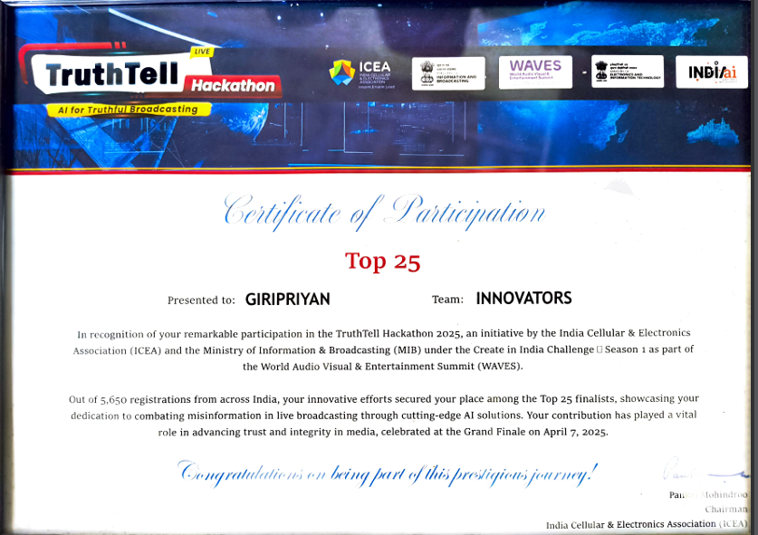
</td>
<td width="33%" align="center">
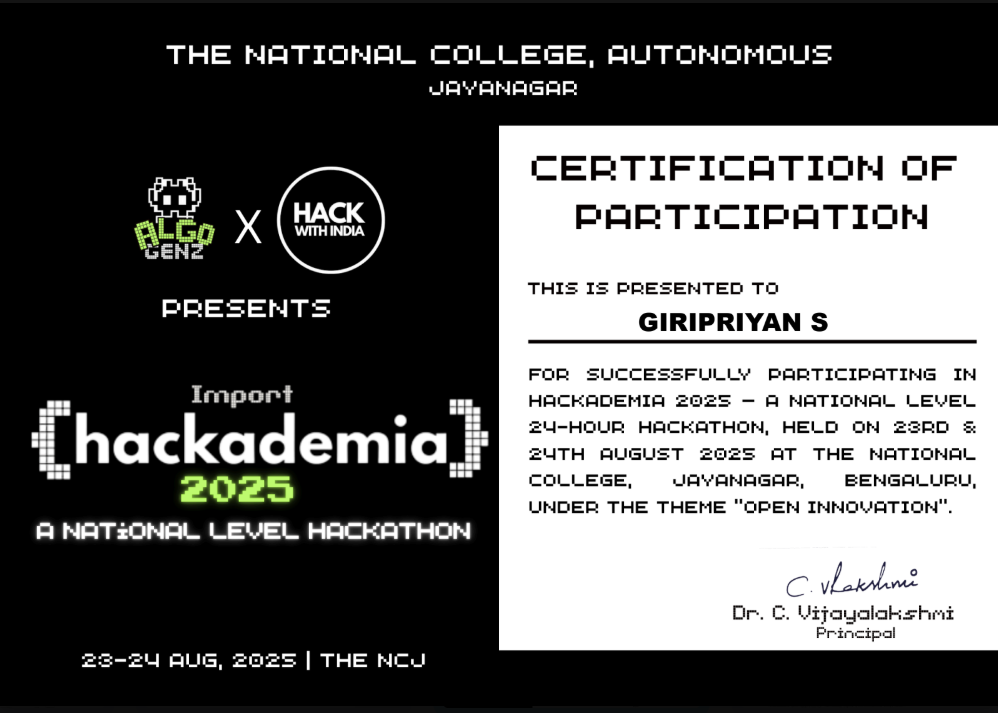
</td>
<td width="33%" align="center">
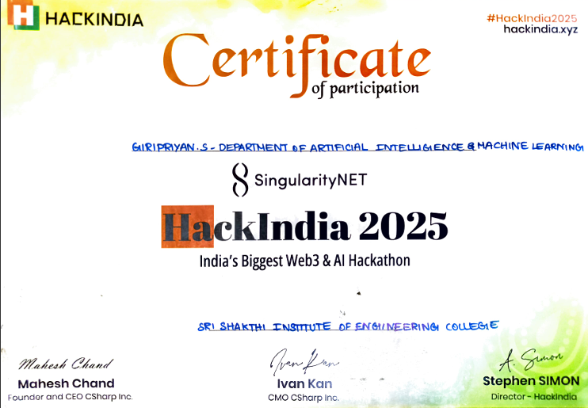
</td>
</tr>
</table>

<h2 align="center">📜 Certificates</h2>
<table>
<tr>
<td width="33%" align="center">

**AI Developer**
C# Corner
 
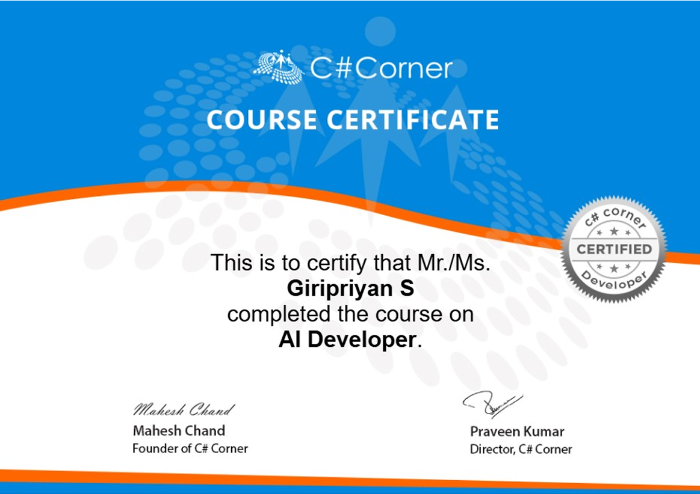

</td>
<td width="33%" align="center">

**Machine Learning**
NoviTech R&D Pvt Ltd
 
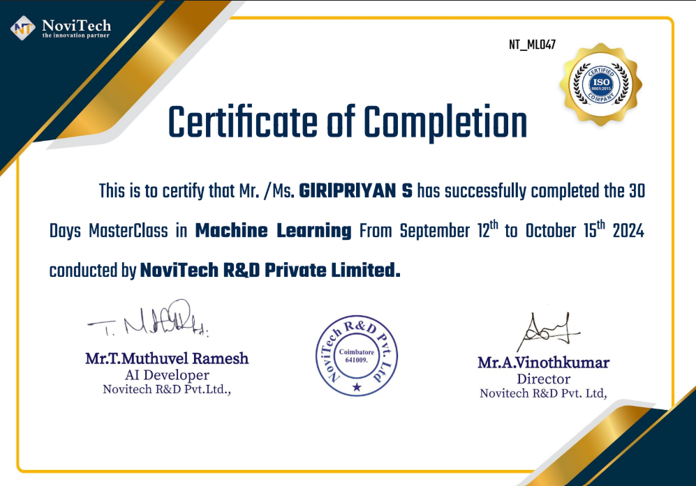

</td>
<td width="33%" align="center">

**Artificial Intelligence**
NoviTech R&D Pvt Ltd
 
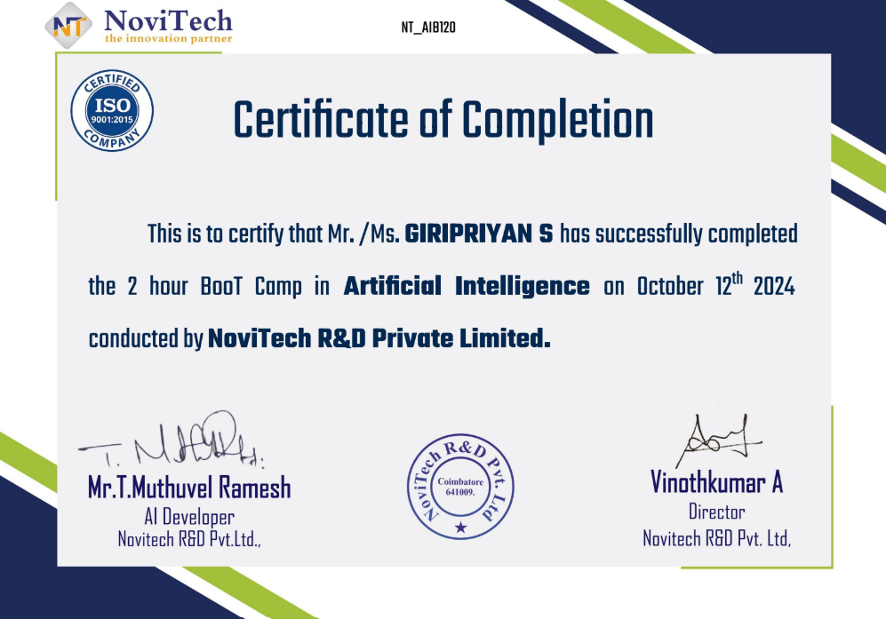

</td>
</tr>
</table>
<!-- 
> 📌 **Action needed:** drop your actual certificate screenshots into `assets/certificates/` using the exact filenames above (`csharp-corner-ai-developer.png`, `novitech-machine-learning.png`, `novitech-artificial-intelligence.png`), and they'll display automatically in the table. -->

---

<!-- ============================================================ -->
<!-- 6. PROJECTS — ONE BY ONE, WITH ARCHITECTURE + PUBLICATION LINKS -->
<!-- ============================================================ -->
## 🚀 Projects

### 🎙️ Voice Fusion — AI-Powered Multilingual Dubbing System

Converts speech dialogue into natural multilingual speech with emotion and lip-sync, through a full pipeline: speech extraction → translation → voice cloning → synthesis → lip-sync, wrapped in a web app.

`Python` `Deep Learning` `Video Processing` `Speech Synthesis` `Voice Cloning` `Flask` `MySQL`

<!-- 


 -->

🔗 **Repo:** [github.com/giripriyansenthilkumar/voice-fusion](https://github.com/giripriyansenthilkumar/VoiceFusionAI) 
📄 **Publication:** [*Paper*](https://www.ijaresm.com/uploaded_files/document_file/Giripriyan_SOL9E.pdf)

---

### 🔍 FactWave — Real-Time Misinformation Detection Tool

Detects misinformation from live audio using speech-to-text (Whisper) plus NLP models (Transformers), then runs real-time fact comparison against a verified dataset.

`Flask` `Whisper` `Transformers` `MongoDB`

<!-- 

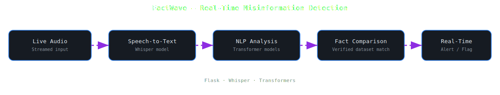

 -->

🔗 **Repo:** [github.com/giripriyansenthilkumar/factwave](https://github.com/giripriyansenthilkumar/Factwave.git)

---

### ✅ AI Approval Process Portal

Automates user approval by validating input against OCR-extracted document data (EasyOCR), using ML-based semantic similarity (TensorFlow) to match text and document fields.

`Python` `Flask` `EasyOCR` `TensorFlow`

<!-- 

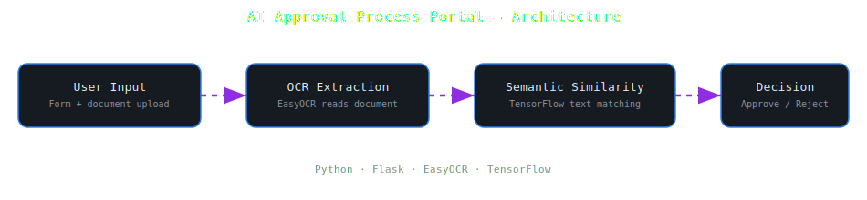

 -->

🔗 **Repo:** [github.com/giripriyansenthilkumar/ai-approval-portal](https://github.com/giripriyansenthilkumar/AI-POWERED-SCHOLARSHIP-APPROVAL-AND-MONITORING-SYSTEM-FOR-PMSSS.git)

---

<!-- ============================================================ -->
<!-- 7. STATS DASHBOARD -->
<!-- ============================================================ -->
## 📊 Stats Dashboard

<!-- 

### 🏆 Trophy Case

 -->

---

<!-- ============================================================ -->
<!-- 8. CONTRIBUTIONS AND COMMITS GRAPH -->
<!-- ============================================================ -->
## 📈 Contributions & Commits

---

<!-- ============================================================ -->
<!-- 9. CONTACT LINKS -->
<!-- ============================================================ -->
## 📫 Let's Connect

  

