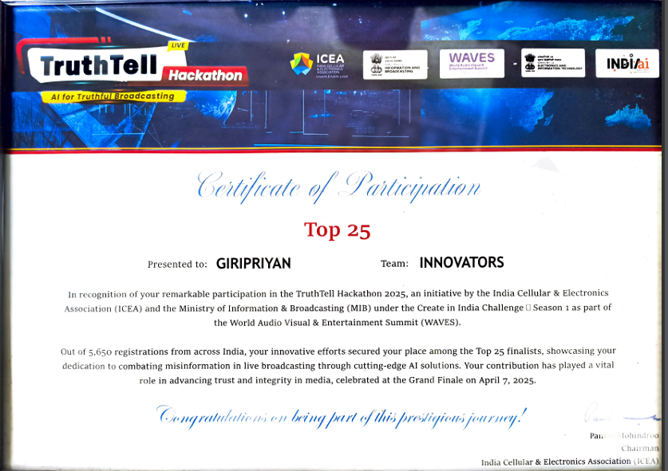
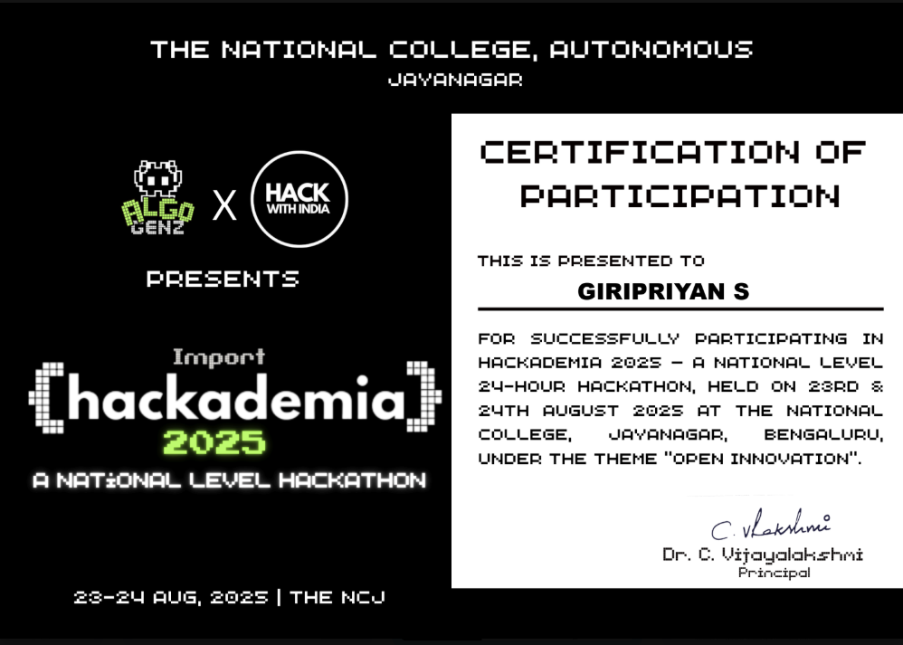
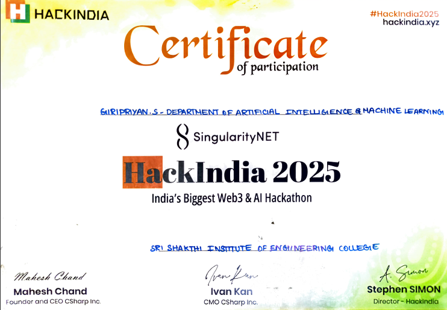
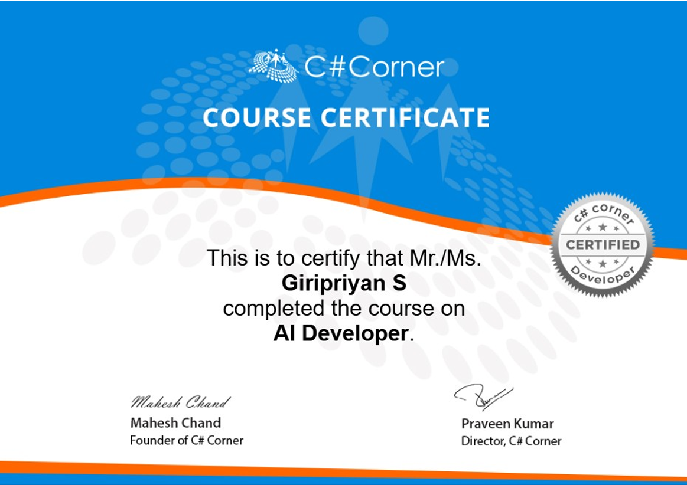
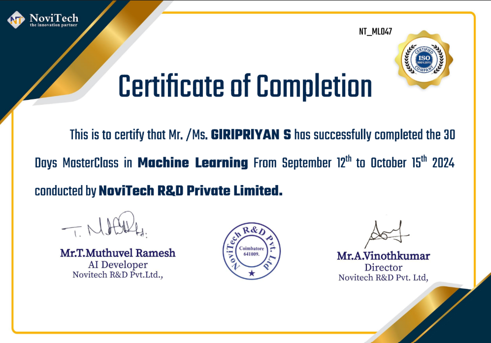
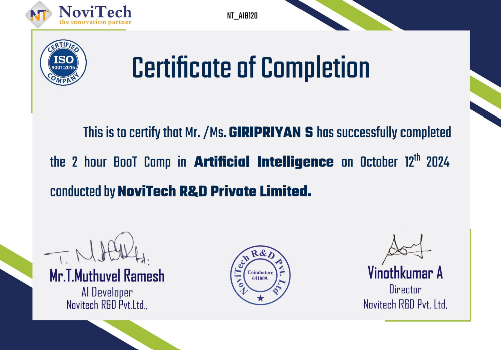

<!-- ============================================================ -->
<!-- 1. ANIMATED INTRO -->
<!-- ============================================================ -->

 

<!-- ============================================================ -->
<!-- 2. ABOUT MYSELF -->
<!-- ============================================================ -->
## 📖 About Myself

I'm an Artificial Intelligence and Machine Learning student building real, working AI systems — not just tutorials. My focus is on the intersection of **speech, language, and vision**: taking research-grade ideas like voice cloning, transformer-based NLP, and OCR-driven verification, and turning them into applications people can actually use.

I like projects that force me to touch the whole stack — from the model, to the pipeline that feeds it, to the interface someone clicks through. That's why each of my projects below goes end-to-end rather than stopping at a notebook.

<!-- ============================================================ -->
<!-- 3. WHO AM I -->
<!-- ============================================================ -->
## 🙋 Who Am I

| | |
|---|---|
| 🎓 **Studying** | B.Tech, Artificial Intelligence & Machine Learning |
| 🏫 **At** | Sri Shakthi Institute of Engineering and Technology, Coimbatore |
| 📍 **Based in** | Coimbatore, India |
| 🧭 **Focused on** | Generative AI · NLP · Computer Vision · Speech Processing · RAG |
| 🛠️ **Currently building** | AI-powered applications with Python, Flask & MongoDB |
| ⚡ **Fun fact** | I'd rather ship a rough working prototype than a polished slide deck |

---

<!-- ============================================================ -->
<!-- 4. SKILLS — INTERACTIVE FLOATING BUBBLE CHART -->
<!-- ============================================================ -->
## ⚔️ Skills

<!-- 
 -->

<!-- 

  <iframe src="./assets/skill_bubble/skills-bubble.html" width="100%" height="600px" style="border: none; overflow: hidden;" scrolling="no">
    <!-- Fallback if iframe is not supported by the Markdown renderer -->

  <!-- </iframe>

 -->

<!--   -->

<!-- Fallback static badges for README rendering -->

**🟣 Languages**

**🟣 AI / ML**

**🔵 Computer Vision**

**🟢 Backend & DB**

**🟡 Tools & Platforms**

---

<!-- ============================================================ -->
<!-- 5. ACHIEVEMENTS WITH CERTIFICATE PREVIEWS -->
<!-- ============================================================ -->
## 🏆 Achievements & Certificates

-2F80ED?style=for-the-badge)

-8E2DE2?style=for-the-badge)
<table>
<tr>
<td width="33%" align="center">

</td>
<td width="33%" align="center">

</td>
<td width="33%" align="center">

</td>
</tr>
</table>

<h2 align="center">📜 Course Certificates</h2>
<table>
<tr>
<td width="33%" align="center">

**AI Developer**
C# Corner
 

</td>
<td width="33%" align="center">

**Machine Learning**
NoviTech R&D Pvt Ltd
 

</td>
<td width="33%" align="center">

**Artificial Intelligence**
NoviTech R&D Pvt Ltd
 

</td>
</tr>
</table>

---

### 👤 Profile

---

<a href="https://leetcode.com/u/giripriyansenthilkumar/">

  

</a>

---

<!-- ============================================================ -->
<!-- 6. PROJECTS -->
<!-- ============================================================ -->
## 🚀 Projects

<table width="100%"><tr><td width="100%">

### 🎙️ Voice Fusion — AI-Powered Multilingual Dubbing System

Converts speech dialogue into natural multilingual speech with emotion and lip-sync, through a full pipeline: speech extraction → translation → voice cloning → synthesis → lip-sync, wrapped in a web app.

`Python` `Deep Learning` `Video Processing` `Speech Synthesis` `Voice Cloning` `Flask` `MySQL`

🔗 **Repo:** [github.com/giripriyansenthilkumar/VoiceFusionAI](https://github.com/giripriyansenthilkumar/VoiceFusionAI)  
📄 **Publication:** [*Paper*](https://www.ijaresm.com/uploaded_files/document_file/Giripriyan_SOL9E.pdf)

</td></tr></table>

 

<table width="100%"><tr><td width="100%">

### 🔍 FactWave — Real-Time Misinformation Detection Tool

Detects misinformation from live audio using speech-to-text (Whisper) plus NLP models (Transformers), then runs real-time fact comparison against a verified dataset.

`Flask` `Whisper` `Transformers` `MongoDB`

🔗 **Repo:** [github.com/giripriyansenthilkumar/Factwave](https://github.com/giripriyansenthilkumar/Factwave.git)

</td></tr></table>

 

<table width="100%"><tr><td width="100%">

### ✅ AI Approval Process Portal

Automates user approval by validating input against OCR-extracted document data (EasyOCR), using ML-based semantic similarity (TensorFlow) to match text and document fields.

`Python` `Flask` `EasyOCR` `TensorFlow`

🔗 **Repo:** [github.com/giripriyansenthilkumar/AI-POWERED-SCHOLARSHIP](https://github.com/giripriyansenthilkumar/AI-POWERED-SCHOLARSHIP-APPROVAL-AND-MONITORING-SYSTEM-FOR-PMSSS.git)

</td></tr></table>

---

<!-- ============================================================ -->
<!-- 7. STATS DASHBOARD -->
<!-- ============================================================ -->
## 📊 Stats Dashboard

---

<!-- ============================================================ -->
<!-- 8. CONTRIBUTIONS AND COMMITS GRAPH -->
<!-- ============================================================ -->
## 📈 Contributions & Commits

---

<!-- ============================================================ -->
<!-- 9. CONTACT LINKS -->
<!-- ============================================================ -->
## 📫 Let's Connect

  

